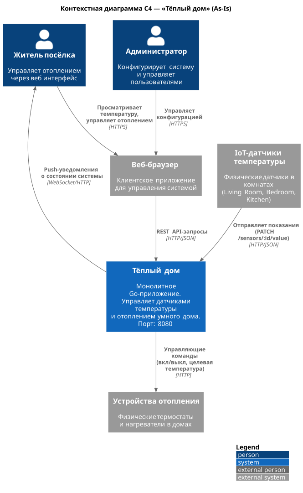
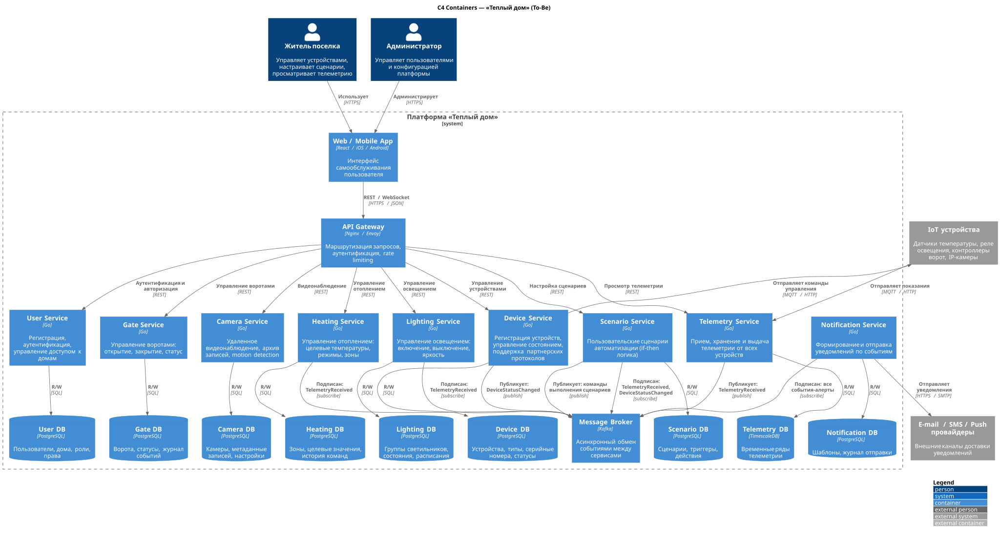
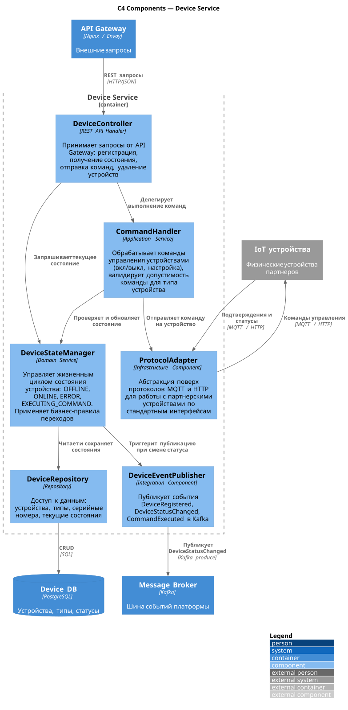
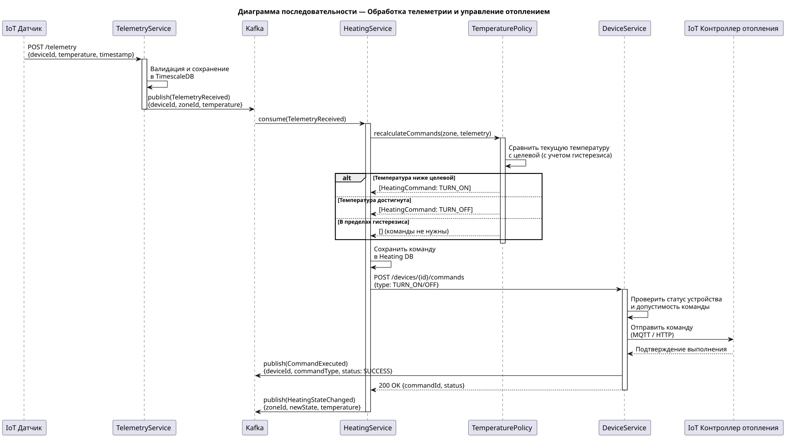
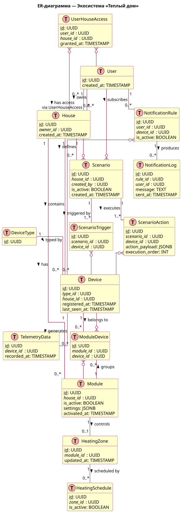

### 1. Описание функциональности монолитного приложения

**Управление отоплением:**

- Пользователи могут включать и отключать отопление в конкретном помещении
- Пользователи могут задавать целевую температуру для помещения
- Система применяет управляющие команды к физическим устройствам отопления

**Мониторинг температуры:**

- Пользователи могут просматривать текущие показания датчиков в разрезе комнат
- Система принимает показания от IoT-датчиков (Living Room, Bedroom, Kitchen и др.)
- Система хранит историю показаний в базе данных

**Управление датчиками (CRUD):**

- Регистрация нового датчика (POST /api/v1/sensors)
- Получение списка всех датчиков и конкретного датчика по ID
- Обновление конфигурации датчика и его текущего значения/статуса
- Удаление датчика из системы

### 2. Анализ архитектуры монолитного приложения

- Язык программирования: Go
- База данных: PostgreSQL (единая, общая для всей бизнес-логики)
- Взаимодействие с клиентом: синхронное, REST HTTP API (порт 8080)
- Взаимодействие с устройствами: синхронные HTTP-запросы (pull/push от датчиков)
- Деплой: Docker-контейнер + docker-compose
- Структура: весь код (HTTP-обработчики, бизнес-логика, доступ к БД) находится
  в едином Go-приложении без разделения на независимые модули

### 3. Определение доменов и границы контекстов

| Домен        | Ответственность                                                                            | Ключевые сущности              |
| ----------------- | --------------------------------------------------------------------------------------------------------- | ---------------------------------------------- |
| Device Management | Регистрация, конфигурация и жизненный цикл устройств        | Device, DeviceType, Location                   |
| Telemetry         | Сбор, хранение и предоставление показаний датчиков            | TelemetryRecord, Sensor, SensorValue           |
| Heating Control   | Бизнес-логика управления отоплением                                       | HeatingZone, TargetTemperature, HeatingCommand |
| User & Auth       | Аутентификация, авторизация, управление доступом к домам | User, House, Permission                        |
| Notifications     | Оповещения об аномалиях, событиях и статусах устройств     | Alert, Notification, Threshold                 |

### 4. Проблемы монолитного решения

- Невозможно независимо масштабировать отдельные части —
  например, модуль телеметрии при росте числа датчиков тянет за собой всё приложение
- Сбой в любом модуле (например, в обработчике отопления)
  останавливает работу всей системы, включая несвязанные функции
- Добавление новых типов устройств (свет, ворота, камеры)
  требует изменений во всём монолите, высок риск регрессий
- Все домены работают с одной БД и одними структурами данных,
  изменение схемы для одного домена затрагивает остальные, что говорит о высокой связности
- Любое изменение требует пересборки и перезапуска
  всего приложения, что увеличивает риски и downtime

### 5. Визуализация контекста системы — диаграмма С4

## Проектирование микросервисной архитектуры

**Декомпозиция монолита на микросервисы:**

| Домен (As-Is монолит) | Микросервис (To-Be) | Источник |
|---|---|---|
| Управление отоплением | `heating-service` | Из монолита |
| Мониторинг температуры | `telemetry-service` | Из монолита |
| — | `user-service` | Новый (SaaS, самообслуживание) |
| — | `device-service` | Новый (самоподключение устройств) |
| — | `lighting-service` | Новый (управление светом) |
| — | `gate-service` | Новый (управление воротами) |
| — | `camera-service` | Новый (видеонаблюдение) |
| — | `scenario-service` | Новый (пользовательские сценарии) |
| — | `notification-service` | Новый (уведомления) |

Компоненты device-service — самого центрального сервиса, без которого SaaS невозможен:

Критичный поток: получение телеметрии → автоматическое управление отоплением. Это ключевая бизнес-логика, объединяющая несколько сервисов:

## Разработка ER-диаграммы

## API

REST API: [api/openapi.yaml](./api/openapi.yaml)  
AsyncAPI: [api/asyncapi.yaml](./api/asyncapi.yaml)  
Интерактивный просмотр REST: https://editor.swagger.io (вставить содержимое openapi.yaml)